<div align="center">

<picture>
  <source media="(prefers-color-scheme: dark)" srcset="docs/screenshots/wordmark-white.png">
  <source media="(prefers-color-scheme: light)" srcset="docs/screenshots/wordmark-dark.png">
  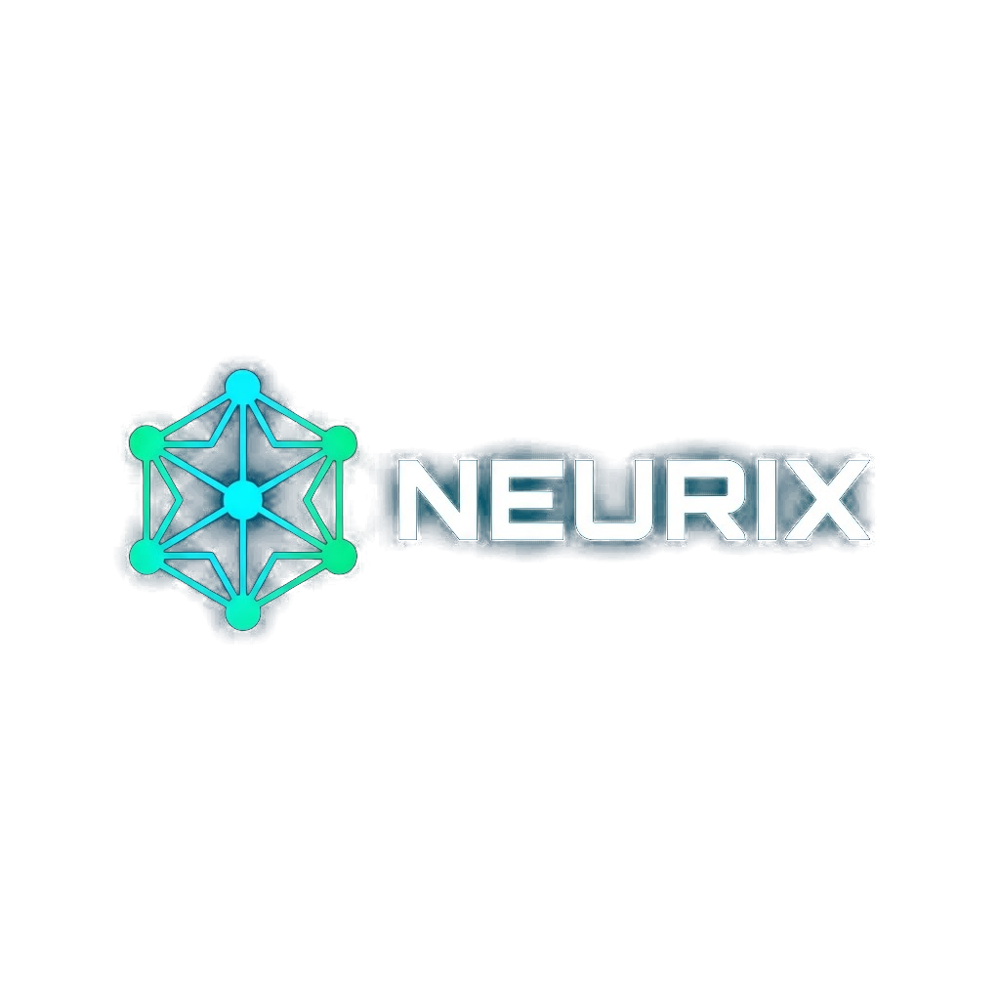
</picture>

### 🧠 Workbench de Machine Learning • 100% Local • Sem IA generativa

**Suba seus dados, explore, treine modelos clássicos, avalie e coloque em produção — tudo no seu navegador, com cálculo determinístico e sem depender de nenhum LLM externo.**

<br/>


</div>

---

## 📑 Índice

- [✨ Por que o Neurix?](#-por-que-o-neurix)
- [🧠 O que é](#-o-que-é)
- [🎬 Recursos de destaque](#-recursos-de-destaque)
- [🏗️ Arquitetura](#️-arquitetura)
- [🖥️ Tour pelas telas](#️-tour-pelas-telas)
- [🧪 Motor de ML local](#-motor-de-ml-local)
- [🚀 Como rodar (passo a passo)](#-como-rodar-passo-a-passo)
- [🔐 Login, 2FA e permissões](#-login-2fa-e-permissões)
- [🎨 Personalização visual](#-personalização-visual)
- [☁️ Deploy na Vercel](#️-deploy-na-vercel)
- [⬆️ Subir no GitHub](#️-subir-no-github)
- [🗂️ Estrutura do projeto](#️-estrutura-do-projeto)
- [👨‍💻 Autor](#-autor)
- [📄 Licença](#-licença)

---

## ✨ Por que o Neurix?

O **Neurix** é uma plataforma de análise de dados e Machine Learning pensada para ser **transparente, determinística e privada**. Diferente de ferramentas que "chutam" respostas com IA generativa, aqui **toda análise é calculada** a partir dos seus dados — você entende exatamente o que aconteceu e por quê.

> 🔒 **Seus dados não saem para nenhum provedor de IA.** Nada de OpenAI, Anthropic ou Gemini. O processamento roda no navegador; a persistência fica no **seu** banco Turso.

| 🚫 O que **não** tem | ✅ O que **tem** |
|---|---|
| Nenhuma chamada a LLM externo | ML clássico 100% local em JavaScript |
| Nenhum custo por token | Cálculo determinístico e reprodutível |
| Nenhuma "caixa preta" | Métricas, pipeline e pré-processamento auditáveis |

---

## 🧠 O que é

Uma **workbench analítica** onde você:

1. 📤 **Sobe um dataset** (CSV, TSV ou Excel `.xlsx`/`.xls`)
2. 🔍 **Explora** os dados (EDA, qualidade, correlação, balanceamento)
3. 🧹 **Prepara** (limpeza, encoding, scaling, feature engineering)
4. 🤖 **Treina modelos** (classificação, regressão, clustering, regras de associação…)
5. 📊 **Avalia** com métricas reais e visualizações
6. 🚀 **Coloca em produção** e faz inferência manual
7. 📄 **Gera relatórios** completos por template

---

## 🎬 Recursos de destaque

- 📁 **Aceita qualquer dataset** — leitura real de **Excel** (SheetJS) e CSV/TSV, com detecção de delimitador e proteção contra arquivos corrompidos.
- ⚖️ **Análise de balanceamento** — distribuição de classes, razão maioria/minoria e veredito (Balanceado → Severo) com recomendações (SMOTE, undersampling, `class_weight`).
- 🧩 **Regras de associação com laudo de aptidão** — o app diz se a base **é apta** ou não para mineração de regras, com nota 0–100 e justificativa.
- 🎯 **Feature selection explicada** — informa o **método** usado (Filter / Wrapper / Embedded) e, se for filtro, **qual** (χ² + Informação Mútua, Pearson + F-test).
- 🔗 **Aba de Modelagem** — pipeline completo do projeto: Dataset → Pré-processamento → Feature Selection → Modelagem → Avaliação.
- 🏷️ **Análises renomeáveis** — dê o nome que quiser (ex.: *Random Forest v1*); a **data/hora** fica sempre automática.
- 🧭 **Clustering não supervisionado** — K-Means, DBSCAN e Hierárquico, sem coluna alvo.
- 🚀 **Tela de Deploy** — veja o modelo "em produção" e faça inferência escolhendo os dados e o classificador.
- 🔐 **Login com 2FA** por app autenticador (Google Authenticator, Authy…).
- 👥 **Controle de usuários** com acesso por página/recurso.
- 🎨 **Temas personalizáveis** — troque a cor de destaque de todo o app (e do logo!).

> 🧠 **Treino de verdade:** os modelos (Regressão Logística, Árvore de Decisão, **Random Forest**, **Gradient Boosting**, **SVM**, KNN, Naive Bayes / Linear, Ridge, Lasso, Árvore, RF, GB) são treinados **sobre todo o dataset**, com split treino/teste e métricas reais — nada de estimativas.

---

## 📸 Screenshots

<div align="center">

| Novo projeto | Explorador de dados | ML Studio |
|:---:|:---:|:---:|
| 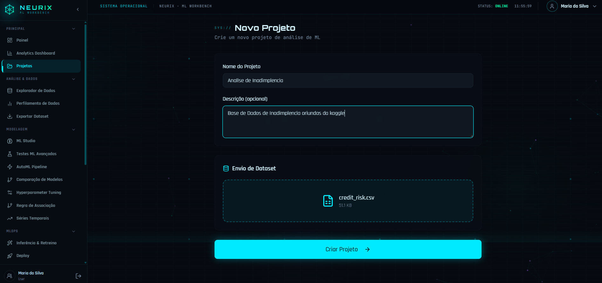 | 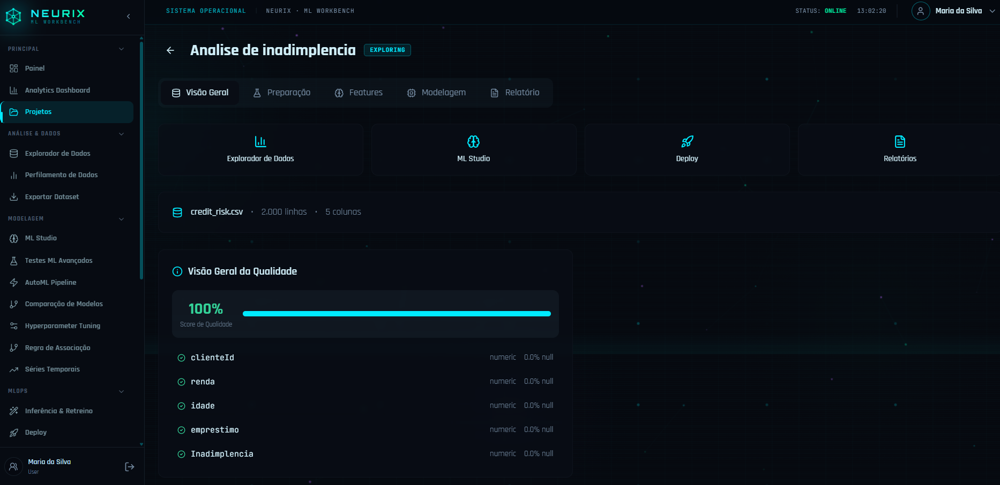 | 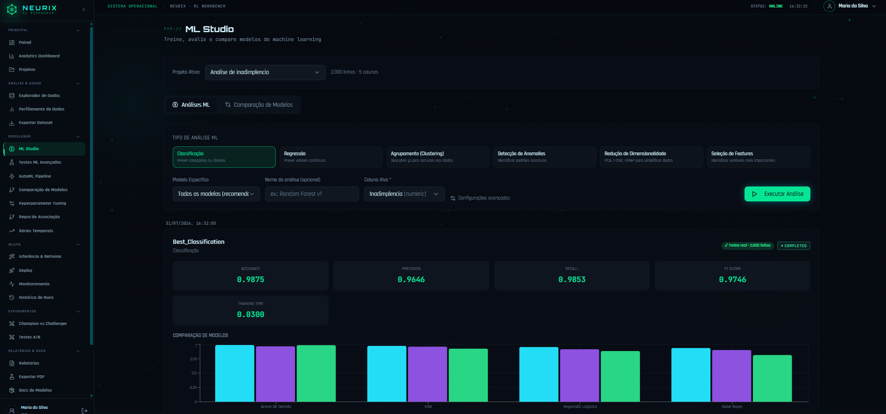 |
| **AutoML Pipeline** | **Pipeline do projeto** | **Regras de associação** |
| 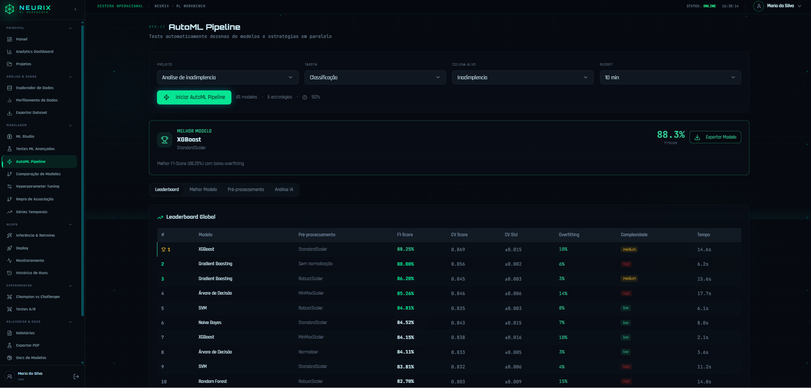 | 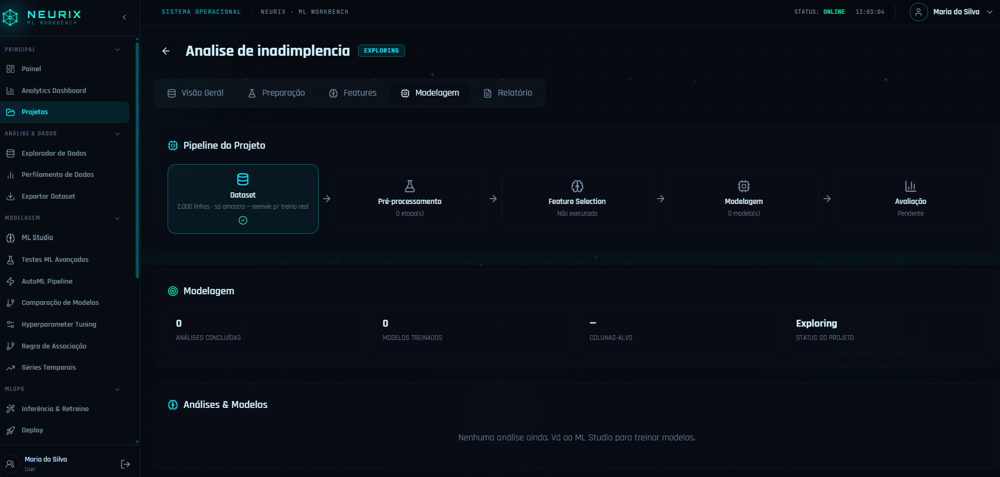 | 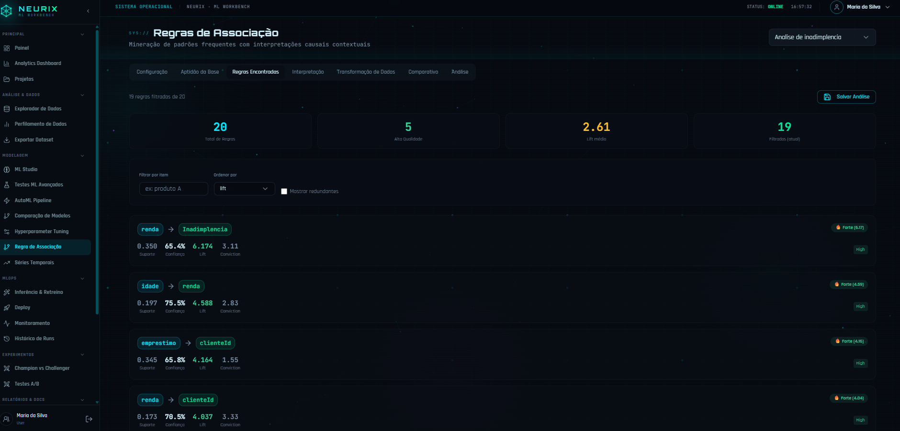 |
| **Champion × Challenger** | **Testes A/B** | **Monitoramento de drift** |
| 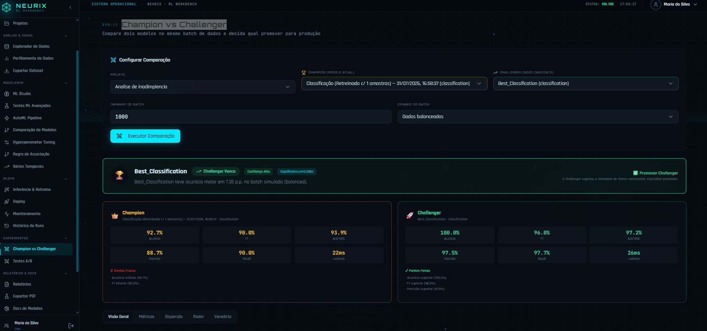 | 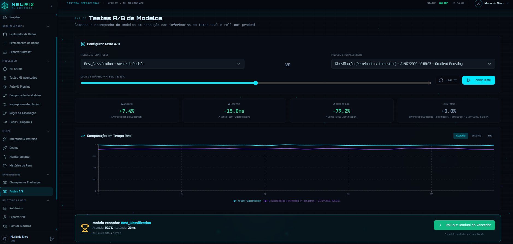 | 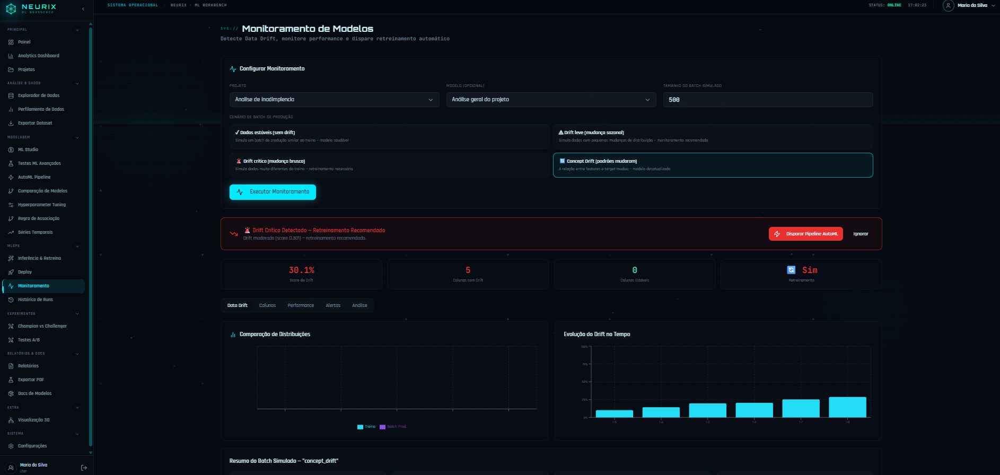 |
| **Inferência & Retreino** | **Inferência causal** | **Calibração de modelos** |
| 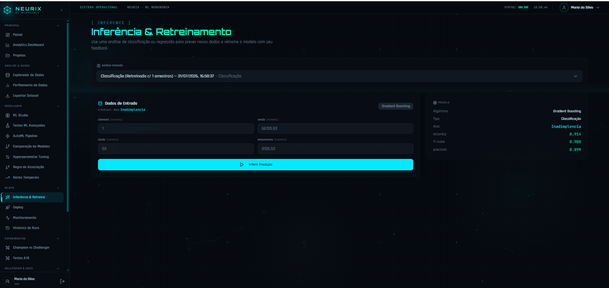 | 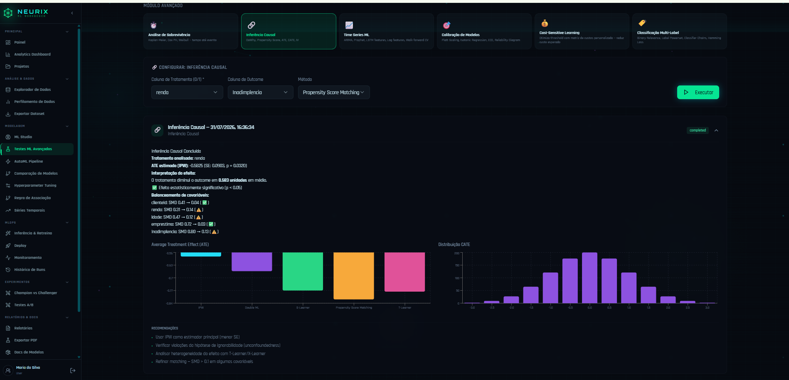 | 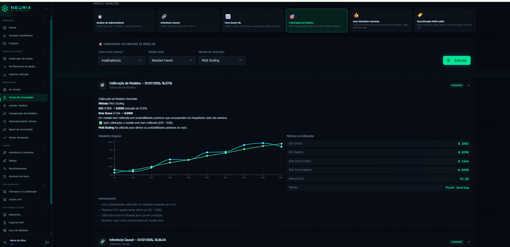 |
| **Visualização 3D (PCA)** | **Relatórios** | **Personalização** |
| 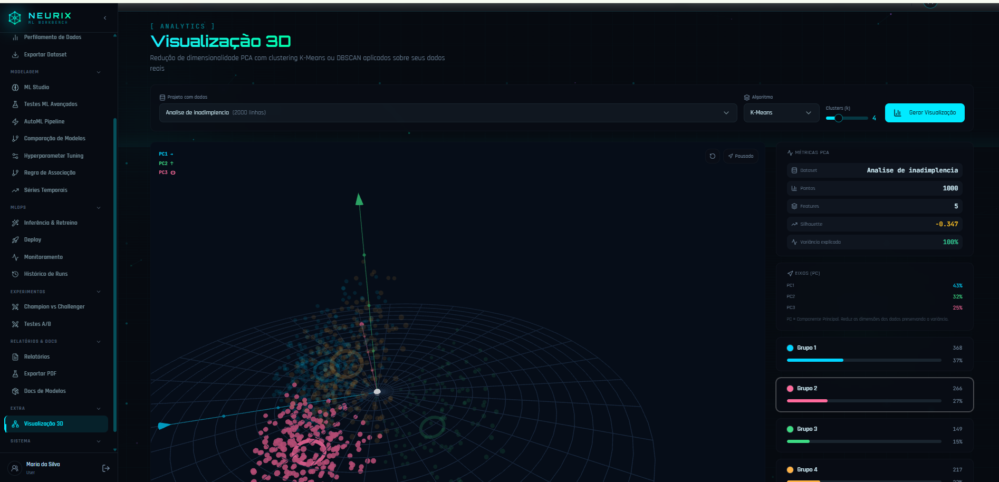 | 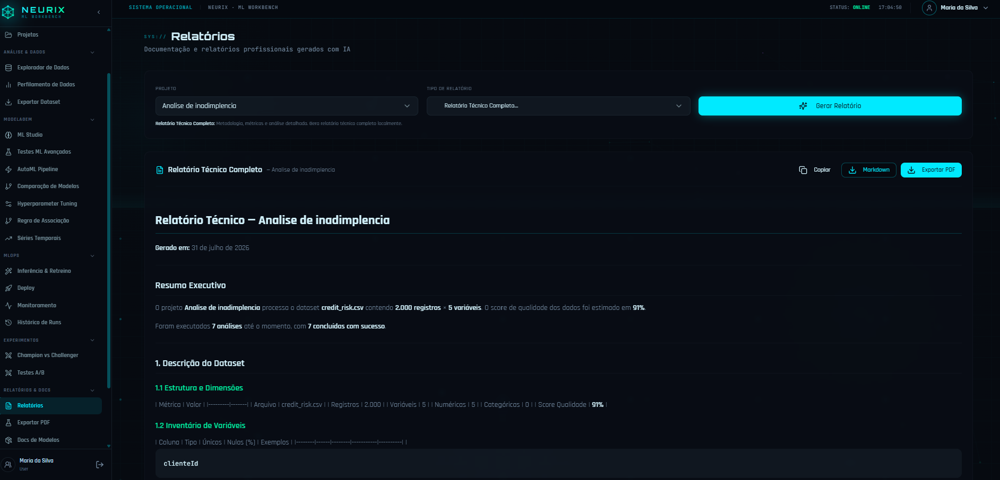 | 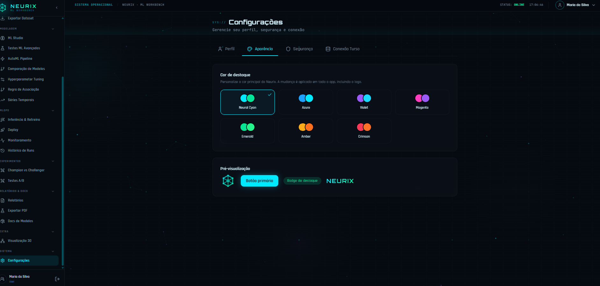 |

</div>

---

## 🏗️ Arquitetura

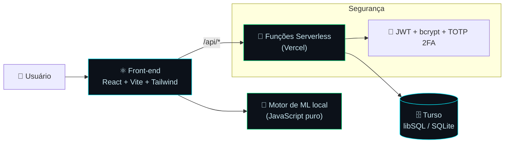

**Stack:** React 18 · Vite 6 · Tailwind 3 · shadcn/ui · Recharts · Three.js · Framer Motion · Turso (libSQL) · Vercel Serverless · JWT + TOTP.

---

## 🖥️ Tour pelas telas

### 🔐 Login
Tela de acesso com senha e **segundo fator (2FA)** por app autenticador. Visual tático com fundo neural animado.

### 🏠 Painel & 📈 Analytics Dashboard
Visão geral com KPIs, contagem de projetos, análises e distribuição por tipo de tarefa.

### 📂 Projetos & ➕ Novo Projeto
Lista de projetos e criação com **upload de dataset** (CSV/Excel). O arquivo é lido e estruturado na hora — colunas, tipos, cardinalidade e nulos.

### 🗺️ Projeto — abas internas
| Aba | O que faz |
|---|---|
| 🧭 **Visão Geral** | Qualidade dos dados, prévia e atalhos rápidos |
| 🧹 **Preparação** | Limpeza, encoding, scaling, imputação de nulos |
| 🧬 **Features** | Feature engineering reutilizável |
| 🔗 **Modelagem** | Pipeline completo + lista de modelos (renomear/excluir) |
| 📄 **Relatório** | Relatório calculado em PDF/Markdown |

### 🔍 Explorador de Dados
EDA completo em abas: **Visão Geral, Distribuições, Outliers, Bivariada (Pearson), Estatísticas, Qualidade, ⚖️ Balanceamento, Correlação (matriz real), Prévia e EDA automática**.

### 🤖 ML Studio
Treine modelos escolhendo **tarefa + algoritmo + hiperparâmetros**. Nomeie a análise, selecione a coluna alvo, rode e compare resultados (métricas, importância de features, interpretação).

### ⚡ AutoML · 🎛️ Hyperparameter Tuning · 🆚 Comparação de Modelos
Pipelines automatizados, busca de hiperparâmetros e ranking de modelos lado a lado.

### 🧩 Regras de Associação
Mineração (Apriori / FP-Growth) **+ aba de Aptidão** que avalia se a base serve para regras de associação, com nota e recomendações.

### 📉 Séries Temporais · 🧪 Testes ML Avançados
Análise temporal e testes estatísticos avançados.

### 🎯 Inferência & Retreino
Insira valores de features → o modelo prevê → você confirma ou corrige (feedback para retreino).

### 🚀 Deploy
Selecione **projeto + classificador** e veja o modelo em produção: endpoint, métricas, schema de entrada, inferência ao vivo, confiança, latência e log de chamadas.

### 📡 Monitoramento · 🕓 Histórico de Runs · ⚔️ Champion vs Challenger · 🧫 Testes A/B
Acompanhamento de drift, histórico de execuções e experimentos comparativos.

### 📊 Relatórios · 📑 Exportar PDF · 📚 Docs de Modelos · 🌐 Visualização 3D
Relatórios por template, exportações e visualização 3D (PCA + clustering) com Three.js.

### ⚙️ Configurações
| Aba | O que faz |
|---|---|
| 👤 **Perfil** | Nome e **foto** (redimensionada automaticamente) |
| 🎨 **Aparência** | Troca a **cor de destaque** de todo o app |
| 🛡️ **Segurança** | Trocar senha e ativar/desativar **2FA** (QR Code) |
| 🗄️ **Conexão Turso** | Status da conexão com o banco |

### 👥 Controle de Usuários *(admin)*
Crie usuários, defina **função** (admin/user), ative/desative, resete senha e escolha **quais páginas/recursos** cada um acessa — o menu se adapta às permissões.

---

## 🧪 Motor de ML local

Tudo roda em JavaScript, sem servidor de IA:

- **Classificação:** Regressão Logística, Árvore de Decisão, Random Forest, KNN, Naive Bayes, SVM
- **Regressão:** Linear, Polinomial, Ridge/Lasso, Árvore, Random Forest
- **Não supervisionado:** K-Means, DBSCAN, Hierárquico, PCA, Isolation Forest
- **Regras de associação:** Apriori, FP-Growth
- **Métricas:** accuracy, precision, recall, F1, ROC-AUC, MSE, RMSE, MAE, R², silhouette, suporte/confiança/lift
- **Pré-processamento:** encoding, scaling, imputação, seleção de features, balanceamento

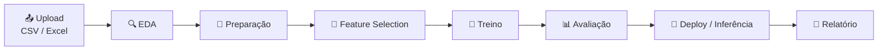

---

## 🚀 Como rodar (passo a passo)

> **Pré-requisitos:** Node.js 18+ e uma conta no [Turso](https://turso.tech).

**1) Instale as dependências**
```bash
git clone https://github.com/ViniciusKanh/Neurix.git
cd Neurix
npm install
```

**2) Configure o `.env`** (use o `.env.example` como base)
```env
TURSO_DATABASE_URL=libsql://seu-banco.turso.io
TURSO_AUTH_TOKEN=seu-token
JWT_SECRET=uma-string-bem-longa-e-aleatoria
TOTP_ISSUER=Neurix
VITE_PUBLIC_TURSO_URL=libsql://seu-banco.turso.io
```

**3) Crie as tabelas + usuário admin**
```bash
npm run db:migrate
```

**4) Rode em desenvolvimento (front + API juntos)**
```bash
npm run dev
```
Acesse **http://localhost:5173** 🎉

**Comandos úteis**
```bash
npm run dev        # front (Vite) + API local juntos
npm run db:migrate # cria tabelas e admin no Turso
npm run build      # build de produção
npm run preview    # pré-visualiza o build
npm run lint       # ESLint
```

---

## 🔐 Login, 2FA e permissões

- Após a migração, entre com o **admin** definido no seed.
- Em **Configurações → Segurança**, ative o **2FA** escaneando o QR Code no seu app autenticador. No próximo login, o Neurix pedirá o código de 6 dígitos.
- Em **Controle de Usuários**, crie novos usuários e marque exatamente **quais telas** cada um pode acessar.

---

## 🎨 Personalização visual

Em **Configurações → Aparência**, escolha entre **7 paletas** (Neural Cyan, Azure, Violet, Magenta, Emerald, Amber, Crimson). A cor é aplicada em botões, badges, bordas, brilhos **e no próprio logo**, com pré-visualização ao vivo. ✨

---

## ☁️ Deploy na Vercel

```bash
npm i -g vercel
vercel login
vercel        # linka o projeto (1ª vez)
vercel --prod # publica em produção
```

No painel da Vercel → **Settings → Environment Variables**, cadastre as mesmas chaves do `.env`
(`TURSO_DATABASE_URL`, `TURSO_AUTH_TOKEN`, `JWT_SECRET`, `TOTP_ISSUER`, `VITE_PUBLIC_TURSO_URL`) e faça o redeploy.

> O front (Vite) e as funções em `/api` são servidos juntos pela Vercel — mesmo comportamento do ambiente local.

---

## ⬆️ Subir no GitHub

O `.gitignore` já protege o `.env` (suas credenciais **não** vão para o Git).

```bash
cd C:\dev\Neurix
git init
git add .
git commit -m "🚀 Neurix — ML Workbench local (Turso + Vercel)"
git branch -M main
git remote add origin https://github.com/ViniciusKanh/Neurix.git
git push -u origin main
```

> Se o repositório já tiver commits e o push for rejeitado, use:
> ```bash
> git pull origin main --allow-unrelated-histories
> # resolva conflitos, se houver, e então:
> git push -u origin main
> ```

Para os próximos envios:
```bash
git add .
git commit -m "descrição da mudança"
git push
```

---

## 📲 Instalar como app / Microsoft Store

O Neurix é um **PWA** — dá para instalar direto do navegador (Edge/Chrome → "Instalar app") e
também **publicar na Microsoft Store**. O manifesto, os ícones e o service worker já estão em `public/`,
e há uma página de **Política de Privacidade** pronta em `/privacy`.

👉 Passo a passo completo (PWABuilder + Partner Center) e textos prontos para a listagem:
**[docs/MICROSOFT_STORE.md](docs/MICROSOFT_STORE.md)**

---

## 🗂️ Estrutura do projeto

```
Neurix/
├── api/                 # 🧩 Funções serverless (Vercel) + libs (Turso, auth, 2FA)
│   └── _lib/            # db, util, handlers, pages, auth
├── scripts/
│   └── migrate.mjs      # cria tabelas + admin no Turso
├── server.mjs           # servidor de API local (dev) — mesmas funções da Vercel
├── src/
│   ├── api/             # client Turso (mesma forma do SDK antigo)
│   ├── assets/          # 🎨 logos
│   ├── components/      # UI, layout, ml, pipeline, project…
│   ├── lib/             # motor de ML local, tema, auth, parser de dataset
│   └── pages/           # todas as telas
├── .env.example
└── SETUP.md
```

---

## 👨‍💻 Autor

<div align="center">

**Desenvolvido por Vinícius Santos** 💚

[](https://github.com/ViniciusKanh)

*Ciência de dados, Machine Learning & engenharia de aplicações.*

</div>

---

## 📄 Licença

Distribuído sob a licença **MIT**. Sinta-se livre para usar, estudar e evoluir. 🚀

<div align="center">

<sub>Feito com 🧠 e ⚡ — <b>Neurix</b> · Machine Learning sem caixa preta.</sub>

</div>
